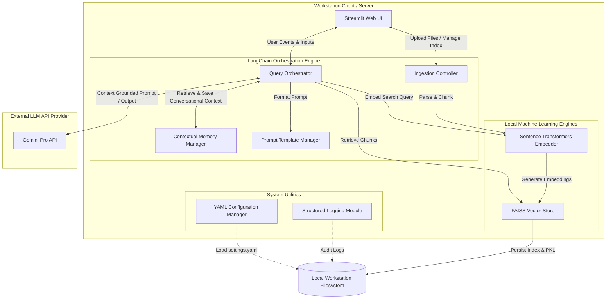
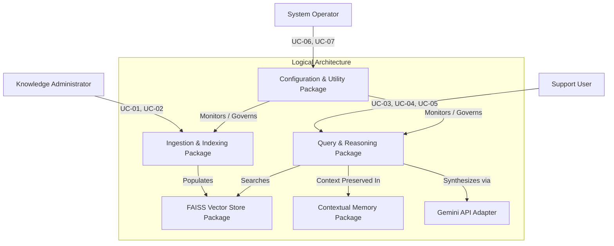
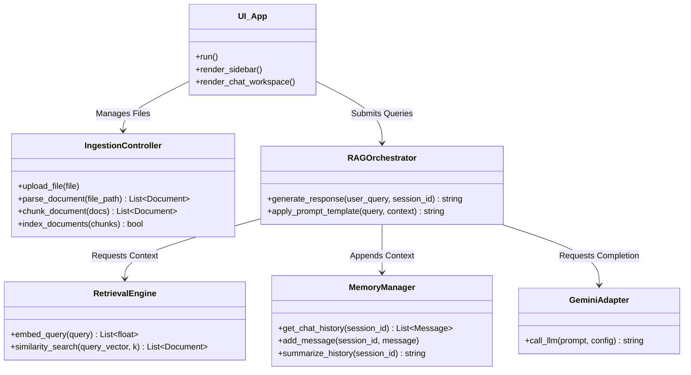
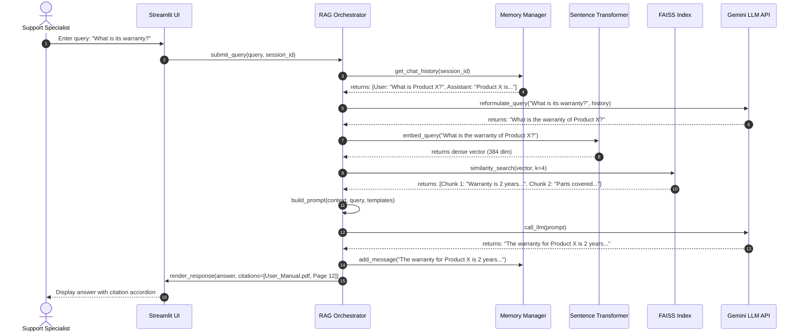
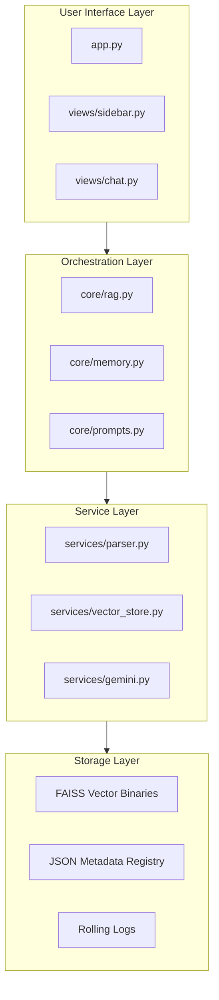

# Product Support Agentic AI Agent with Contextual Memory and Multi-Document Reasoning
## Software Architecture Document (High-Level Design)

## Revision History

| Version No | Date | Prepared by / Modified by | Significant Changes |
|---|---|---|---|
| 1.0 | 2026-06-13 | Chief Software Architect | Initial Software Architecture Document / High-Level Design |

---

## 1 Overview

### 1.1 Purpose

This Software Architecture Document (SAD) provides a comprehensive architectural overview of the **Product Support Agentic AI Agent**. It details the architectural decisions, structural patterns, and component interactions that govern the system. The target audience includes senior developers, operations teams, security auditors, and system administrators.

### 1.2 Scope

The scope of this high-level design covers the entire agentic solution:
- UI layer (Streamlit components).
- Core orchestration and workflow layer (LangChain modules).
- Semantic search engine and index storage (Sentence Transformers + FAISS).
- Integration interfaces for external Gemini LLM APIs.
- Supporting architectural utilities (logging, memory, security, configurations).

### 1.3 Definitions, Acronyms and Abbreviations

For consistency, refer to the glossary in the SRS document. The following additional terms apply:

| Term | Definition |
|---|---|
| Contextual Retrieval | Retrieval process that utilizes session history to frame and semantic search for documents |
| RAG | Retrieval-Augmented Generation: technique to inject retrieved document facts into an LLM context |
| Vector Index | High-dimensional numeric index optimized for fast similarity search |
| Local Ingestion | Server/workstation-level text extraction and vectorization without transmitting raw data |

### 1.4 References

1. [SRS Document](file:///d:/hcl/Product_Support_Agentic_AI_SRS.md) - Software Requirements Specification.
2. [UID Document](file:///d:/hcl/Product_Support_Agentic_AI_UID.md) - User Interface Design.
3. LangChain Documentation - Core orchestration patterns.
4. FAISS Project - Vector database library specifications.

### 1.5 Overview

Section 2 introduces the system's global architecture.  
Section 3 details architectural goals and constraints.  
Section 4 maps the use cases to logical modules.  
Section 5 through 9 describe the Logical, Process, Deployment, Implementation, and Data views.  
Section 10 outlines sizing and performance bounds.  
Section 11 explains construction tactics, and Section 12 details alternate designs.

---

## 2 Architectural Representation

The system utilizes a **Layered Pipe-and-Filter and Service-Oriented Architecture (RAG Pattern)**. Processing steps are encapsulated in modular components (filters) linked in sequence, while the core reasoning is delegated to a service-based LLM interface.



---

## 3 Architectural Goals and Constraints

The system architecture is designed around several core quality attributes:

1. **Security & Privacy (Highest Priority)**: Product documentation must reside and be processed locally. Vector embeddings and similarity comparisons are strictly local. Raw document context is only sent to the Gemini API during query synthesis via HTTPS.
2. **Sub-second Response Times**: Vector search over local indices must complete within milliseconds. Ingestion of documents up to 50MB should run concurrently in background threads to avoid blocking the main UI event loop.
3. **Conversational Coherence**: Follow-up questions must carry session history to resolve coreferences (e.g., "What is its price?" after asking "What is Product X?").
4. **Offline Capability (Degraded Mode)**: Document parsing, indexing, and similarity search must operate completely offline.
5. **No Database Overhead**: The system avoids heavy distributed databases. Instead, it leverages local FAISS binaries and metadata JSON registries stored directly on the workstation filesystem.

---

## 4 Use Case View

The use case view associates user-driven requirements directly to the high-level architectural packages:



---

## 5 Logical View

### 5.1 Overview

The Logical View outlines the static design packages that structure the codebase. The application adopts a clean, modular structure where logic classes communicate via strict interfaces, separating the visual rendering from the semantic search and RAG orchestration.

### 5.2 Architecturally Significant Design Packages



### 5.3 Use Case Realization (Component Diagram)

```mermaid
component "User Interface Component" as UI {
  port "File Upload" as p1
  port "Chat Input" as p2
}

component "Ingestion Pipeline" as Ingest {
  [File Parser] --> [Recursive Chunk Splitter]
}

component "Semantic Search Engine" as Search {
  [FAISS Index Client] --> [SentenceTransformer Embedder]
}

component "Agent Orchestrator" as Orchestrator {
  [LangChain RAG Chain] --> [Memory Cache]
}

database "Local Disk Storage" as DB {
  [FAISS Binaries]
  [Metadata JSON]
}

UI --> Ingest
Ingest --> Search
Search --> DB
UI --> Orchestrator
Orchestrator --> Search
Orchestrator --> [Gemini Client API]
```

---

## 6 Process View

### Process Flow: Conversational Query and Contextual Retrieval
The sequence diagram below displays the end-to-end execution path when a user submits a query.



---

## 7 Deployment View

The application is deployed on a workstation or a virtual machine, requiring zero external server-side database infrastructure.

```mermaid
node "User Workstation VM / PC" {
  node "Python 3.9+ Runtime" {
    component "Streamlit UI App (localhost:8501)" as StreamlitApp
    component "LangChain RAG Engine" as Engine
    component "Local Sentence Transformers Model" as EmbModel
  }
  
  node "Local Hard Drive" {
    folder "data/" {
      file "metadata.json"
      file "settings.yaml"
    }
    folder "faiss_store/" {
      file "index.faiss"
      file "index.pkl"
    }
    folder "logs/" {
      file "support_agent.log"
    }
  }
}

node "Google Cloud Platform" {
  component "Gemini API Gateway" as GCPGemini
}

StreamlitApp --> Engine
Engine --> EmbModel
Engine --> "faiss_store/" : Read / Write
Engine --> "data/" : Read / Write
Engine --> "logs/" : Write
Engine --> GCPGemini : HTTPS POST (Port 443)
```

---

## 8 Implementation View

### 8.1 Overview

The physical layout of the codebase is structured around a modular Python package design, segregating utility routines, model definitions, and UI layouts into separate files.

### 8.2 Layers



---

## 9 Data View

### 9.1 FAISS Vector Store Architecture
The FAISS index utilizes an `IndexFlatL2` or `IndexFlatIP` (Inner Product/Cosine Similarity) structure. 

```
FAISS Index File (.index)
+-----------------------------------------------------+
| Index ID | Embedding Vector (384 float dimensions)  |
|----------|------------------------------------------|
| 0        | [0.012, -0.045, ..., 0.089]              |
| 1        | [0.114, 0.002, ..., -0.054]              |
+-----------------------------------------------------+
                          |
                          v mapped by Index ID
Pickled Metadata Store (.pkl)
+-------------------------------------------------------------------------------+
| Index ID | Document Source  | Page/Row | Raw Text Chunk                       |
|----------|------------------|----------|--------------------------------------|
| 0        | User_Manual.pdf  | Page 4   | "To restart the router, press..."     |
| 1        | Release_Notes.txt| Row 12   | "Version 2.4 adds support for..."    |
+-------------------------------------------------------------------------------+
```

### 9.2 Contextual Memory Architecture
Conversational history is stored locally in the Streamlit session state and mapped to a local memory cache using `ConversationSummaryBufferMemory`. As session logs grow, the system issues a summarization step to compress historical context, preventing token bloat during subsequent Gemini calls.

### 9.3 Retrieval Architecture & Re-ranking Flow
1. **Query Embedder**: Generates embedding of search query.
2. **FAISS Retrieval**: Returns top 10 similarity hits.
3. **Citation & Source Matcher**: Compares chunk margins to filter duplicates.
4. **Context Assembler**: Concatenates text blocks with clear boundary markers (e.g., `<doc name="User_Manual.pdf" page="4">...</doc>`).
5. **Prompt Injection**: Injects formatted string into Gemini payload.

---

## 10 Size and Performance

The application is structured to perform optimally within standard workstation environments:

| Metric | Target Bounds | Hardware Condition |
|---|---|---|
| **RAM Footprint (Static)** | 600MB - 1GB (loads Sentence Transformers model) | 8GB workstation RAM |
| **RAM Footprint (Scale)** | Increase of 150MB per 10,000 indexed chunks | 16GB workstation RAM |
| **Parsing & Chunking** | < 1 second per 50 pages | PDF standard text extraction |
| **Indexing Speed** | ~ 40 chunks per second | CPU embedding generation |
| **Disk Storage** | 200MB (Python libraries) + ~15MB per vector store index | Standard HDD/SSD |
| **Search Response** | < 20 milliseconds similarity lookup | FAISS local indexing |

---

## 11 Construction Strategy

### 11.1 Proof of Concept Strategy
Prior to building the UI, a CLI-based script will validate the RAG pipeline:
1. Load a sample 20-page product PDF.
2. Run local Sentence Transformers embedding and build a temporary FAISS index.
3. Execute basic queries to check context retrieval and Gemini API responses.
4. Test session serialization to make sure history remains clean.

### 11.2 Buy / Reuse Identification
* **Orchestration**: Reuse LangChain framework blocks rather than building custom parser/RAG managers from scratch.
* **Vector Math**: Reuse FAISS binaries.
* **Embeddings**: Reuse HuggingFace `SentenceTransformers` model library.
* **UI**: Reuse Streamlit's built-in `chat_message` and `file_uploader` components.

---

## 12 Alternate Design Methods Considered

### 12.1 Design Methods Analysis

The table below contrasts the chosen architectural technologies against alternative designs:

| Architectural Component | Selected Technology | Alternative Considered | Trade-off Rationale |
|---|---|---|---|
| **Vector DB** | **FAISS (Local)** | Pinecone / Milvus (Cloud / Distributed) | FAISS is free, runs locally, and requires zero external credentials or network latency. Highly portable for offline tasks. |
| **Embeddings** | **Sentence Transformers (Local)** | Google Gemini / OpenAI Embeddings API | Using a local embedding model reduces cost, eliminates network dependencies for vector search, and guarantees security. |
| **UI Framework** | **Streamlit** | React.js / FastAPI | Streamlit enables rapid internal prototyping using pure Python. Avoids complex node module dependencies and CORS configurations. |
| **Orchestration** | **LangChain** | Custom Python Engine | LangChain provides pre-built document loaders, memory management, and model output parsers, accelerating time to market. |
| **LLM Orchestrator**| **Gemini Pro API** | Local Llama-3 (Ollama) | Gemini provides superior reasoning and context synthesis, while keeping workstation hardware requirements low. |
