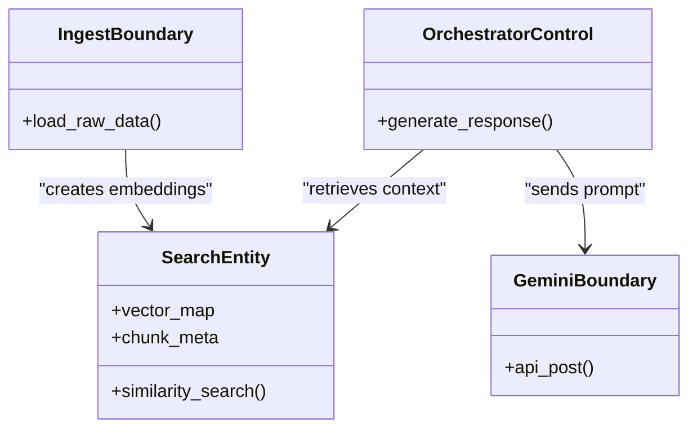
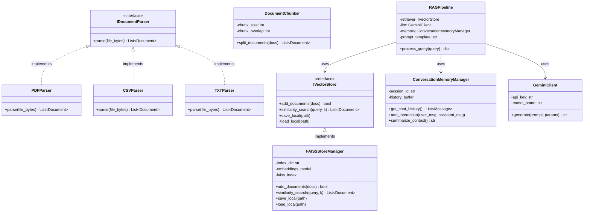
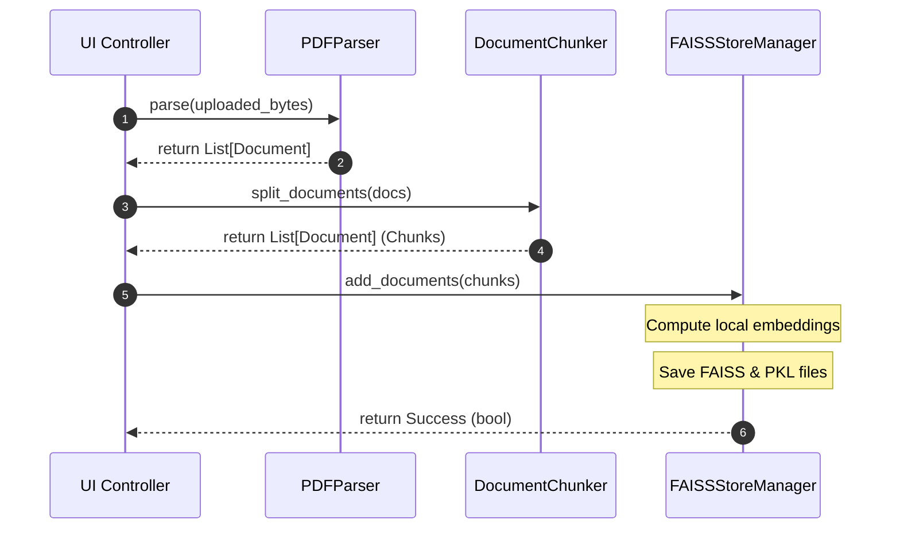
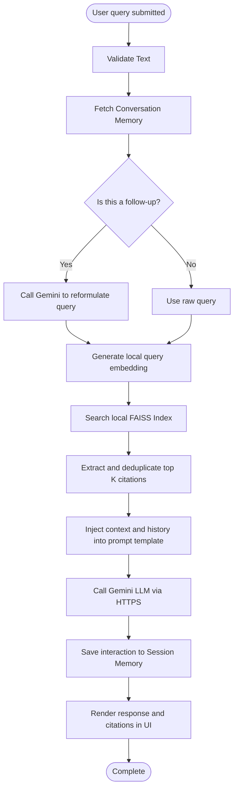
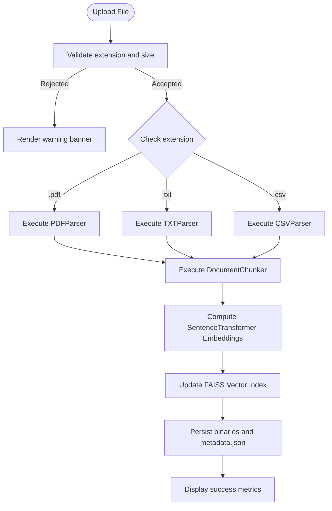

# Product Support Agentic AI Agent with Contextual Memory and Multi-Document Reasoning
## Software Low-Level Design (LLD) Document

## Revision History

| Version No | Date | Prepared by / Modified by | Significant Changes |
|---|---|---|---|
| 1.0 | 2026-06-13 | Senior Software Designer | Initial Software Low-Level Design specification |

---

## 1 Overview

### 1.1 Purpose

This Low-Level Design (LLD) document details the code-level structure, class designs, interface contracts, error-handling mechanisms, and execution workflows for the **Product Support Agentic AI Agent**. It translates the High-Level Design (HLD) architecture into concrete Python modules.

### 1.2 Scope

This LLD applies to all modules in the application repository:
- **UI Screen Controllers**: Streamlit state rendering engines.
- **Parser & Ingestion Pipeline**: Classes for text extraction and segment chunking.
- **Embedding & Search Engine**: local `sentence-transformers` and `FAISS` index.
- **RAG & Memory Managers**: Context assemblies, prompt interpolation, and Gemini client wrappers.
- **Utility Modules**: File loggers, configurations, and test classes.

### 1.3 Brief Description of Product

The system is a local RAG utility designed to query product documents (PDF, TXT, CSV) using local embeddings and similarity indices. The synthesized answers are generated by Google's Gemini Pro API, backed by session memory and direct citations.

---

## 2 System Environment

The system operates as a single-node Python workspace communicating with the external Gemini API:

```
                  +-----------------------------------+
                  |        Workstation Local          |
                  |                                   |
                  |  +-------------+  +------------+  |
                  |  |  Streamlit  |  | Ingestion  |  |
  File Uploads ----> |  Frontend   |  |  Pipeline  |  |
                  |  +------+------+  +-----+------+  |
                  |         |               |         |
                  |         v               v         |
                  |  +-------------+  +------------+  |
                  |  | RAG Engine  |  | FAISS & ST |  |
  Chat Queries ----> |  & Memory   |  | Local Store|  |
                  |  +------+------+  +------------+  |
                  |         |                         |
                  +---------|-------------------------+
                            | HTTPS POST
                            v
                  +-----------------------------------+
                  |       Google Gemini API           |
                  +-----------------------------------+
```

### 2.1 System Inputs

* **Ingested Documents**: Raw binary files in PDF (`.pdf`), plain text (`.txt`), and comma-separated values (`.csv`) via the Streamlit file upload widget.
* **Support Queries**: Natural language question strings entered in the chat interface.
* **Configurations**: YAML settings specifying model parameters, chunk bounds, path bindings, and system prompt text templates.
* **Credentials**: Google API keys supplied via environment variables (`GEMINI_API_KEY`) or UI text inputs.

### 2.2 System Outputs

* **Structured Responses**: Markdown text answers synthesised by the LLM.
* **Citations & Metadata**: Evidence arrays containing source names, chunk IDs, page/row counts, and matching content snippets.
* **Index Artifacts**: Persisted FAISS binary files (`index.faiss`) and serialized metadata stores (`index.pkl`).
* **Operational Logs**: Local logs detailing warnings, errors, processing milestones, and similarity stats.

---

## 3 Hardware and Software Platforms

### 3.1 Hardware

* **Minimum Workstation Requirements**:
  - CPU: Dual-core x86_64, 2.0 GHz
  - RAM: 8GB (required to load local Sentence Transformers)
  - Disk: 500MB free space
* **Recommended Workstation Requirements**:
  - CPU: Quad-core x86_64 or Apple Silicon
  - RAM: 16GB
  - Disk: 2GB SSD (faster loading of index binaries)
  - GPU: CUDA-compatible NVIDIA GPU (optional, accelerates embedding computations)

### 3.2 Software

* **Operating System**: Windows 10/11, macOS 12+, Ubuntu Linux 20.04+
* **Runtime Platform**: Python 3.9, 3.10, or 3.11
* **Core Libraries & Package Dependencies**:
  - `streamlit >= 1.25.0`
  - `langchain >= 0.1.0`
  - `langchain-google-genai >= 1.0.0`
  - `faiss-cpu >= 1.7.4` (or `faiss-gpu` for CUDA hardware)
  - `sentence-transformers >= 2.2.2`
  - `pypdf >= 3.9.0`
  - `pyyaml >= 6.0`

---

## 4 Process Model

### 4.1 Analysis Model

#### 4.1.1 Introduction
The analysis model defines structural entities and boundary components using logical groupings (analysis packages).

#### 4.1.2 Analysis Packages
1. **Ingest Boundary Package**: Interfaces responsible for loading files.
2. **Search Entity Package**: Vector similarity mapping structures.
3. **Reasoning Control Package**: RAG synthesis loops.
4. **Log Utility Package**: Diagnostics recording.

#### 4.1.3 Classes
- **FileBoundary**: Interacts with the local file system.
- **IndexRegistryEntity**: Tracks which records are loaded.
- **QueryControl**: Orchestrates prompt and LLM call processes.

#### 4.1.4 Relationships
- `FileBoundary` populates the `IndexRegistryEntity`.
- `QueryControl` queries the `IndexRegistryEntity` and delegates synthesis to the LLM Client.

#### 4.1.5 Use Case Realization
Ingestion updates the search index, enabling the querying flow to isolate relevant chunks.

#### 4.1.6 Diagrams (Analysis Class Model)



---

### 4.2 Design Model

#### 4.2.1 Introduction
The Design Model contains detailed Python classes, interfaces, attributes, and execution signatures.

#### 4.2.2 Design Model Hierarchy
The code structure maps directly to three design subsystems: Ingestion Subsystem, Retrieval Subsystem, and Orchestration Subsystem.

#### 4.2.3 Diagrams of Design Model (UML Class Diagram)



#### 4.2.4 Design Packages / Design Subsystem
* `parsers`: Contains `PDFParser`, `CSVParser`, and `TXTParser`.
* `indexing`: Holds `DocumentChunker` and `FAISSStoreManager`.
* `orchestration`: Houses `RAGPipeline` and `ConversationMemoryManager`.

#### 4.2.5 Classes (Detailed Specification)

##### Class: `PDFParser`
* **Attributes**: None.
* **Methods**:
  - `parse(file_bytes: bytes) -> List[Document]`: Uses `pypdf.PdfReader` to extract page text and return list of LangChain `Document` objects with metadata: `{"source": filename, "page": page_idx}`.

##### Class: `CSVParser`
* **Attributes**: None.
* **Methods**:
  - `parse(file_bytes: bytes) -> List[Document]`: Uses standard Python `csv.DictReader` to convert structured rows into key-value pairs, outputting a Document for each row with metadata: `{"source": filename, "row": row_idx}`.

##### Class: `TXTParser`
* **Attributes**: None.
* **Methods**:
  - `parse(file_bytes: bytes) -> List[Document]`: Decodes byte arrays into UTF-8 strings, outputting a single Document object with metadata: `{"source": filename}`.

##### Class: `DocumentChunker`
* **Attributes**:
  - `chunk_size: int` (Default: 1000)
  - `chunk_overlap: int` (Default: 200)
* **Methods**:
  - `split_documents(docs: List[Document]) -> List[Document]`: Uses LangChain's `RecursiveCharacterTextSplitter` with separators `["\n\n", "\n", " ", ""]` to fragment text.

##### Class: `FAISSStoreManager`
* **Attributes**:
  - `index_dir: str`
  - `embeddings_model: SentenceTransformer`
  - `faiss_index: FAISS`
* **Methods**:
  - `add_documents(docs: List[Document]) -> bool`: Generates embeddings and updates the index.
  - `similarity_search(query: str, k: int) -> List[Document]`: Computes query embedding and retrieves top $K$ documents.
  - `save_local(path: str)`: Persists FAISS binaries.
  - `load_local(path: str)`: Loads FAISS files from disk.

##### Class: `ConversationMemoryManager`
* **Attributes**:
  - `session_id: str`
  - `history_limit: int` (Default: 10 messages)
* **Methods**:
  - `get_chat_history() -> List[Message]`: Returns memory buffers.
  - `add_interaction(user_msg: str, assistant_msg: str)`: Appends message logs.
  - `summarize_context() -> str`: Calls Gemini to condense history when history count exceeds limits.

##### Class: `GeminiClient`
* **Attributes**:
  - `model_name: str` (Default: "gemini-1.5-pro")
  - `temperature: float` (Default: 0.2)
* **Methods**:
  - `generate(prompt: str, params: dict) -> str`: Issues API requests to the Google Gemini model.

##### Class: `RAGPipeline`
* **Attributes**:
  - `retriever: IVectorStore`
  - `llm: GeminiClient`
  - `memory: ConversationMemoryManager`
  - `prompt_template: str`
* **Methods**:
  - `process_query(query: str) -> dict`: Orchestrates query reformulation, vector retrieval, prompt compilation, and answer extraction. Returns `{"answer": response, "citations": list_of_dicts}`.

#### 4.2.6 Capsules
* **Not Applicable**: Capsules are active concurrency entities communicating via physical ports in real-time modeling frameworks (e.g., UML-RT). This Python application runs on standard threads and event loops, making capsules unnecessary.

#### 4.2.7 Interfaces
* **`IDocumentParser`**: Declares `parse(file_bytes)` signature.
* **`IVectorStore`**: Declares index interaction methods (`add_documents`, `similarity_search`, `save_local`, `load_local`).

#### 4.2.8 Protocols
* **`HTTP/HTTPS`**: REST communications with Google Gemini API endpoints.
* **`Local File System Protocol`**: OS-level read/write transactions for settings, logs, and indices.

#### 4.2.9 Events and Signals (Sequence Diagram)



#### 4.2.10 Relationships
* `RAGPipeline` has a composition relationship with `IVectorStore`, `GeminiClient`, and `ConversationMemoryManager`.

#### 4.2.11 Use Case Realization (Activity Diagram: Query Ingestion & Answer Synthesis)



#### 4.2.12 Diagrams (Activity Diagram: Document Ingestion Pipeline)



#### 4.2.13 Testability Class

To ensure verification, the following unit testing classes are configured:

```python
class TestIngestionPipeline:
    def test_pdf_parsing(self):
        """Passes a mock PDF byte-stream to PDFParser, validating document chunk count."""
        pass
        
    def test_csv_structure(self):
        """Validates CSVParser output keys map row metadata correctly."""
        pass

class TestRetrievalEngine:
    def test_similarity_search(self):
        """Inserts known text chunks, runs similarity query, and asserts exact match returns as Rank-1."""
        pass

class TestRAGOrchestrator:
    def test_memory_context_injection(self):
        """Asserts history parameters are formatted correctly into final prompt outputs."""
        pass
```

---

### 4.3 Design Constraints

* **Global Interpreter Lock (GIL)**: Standard Python runtime constraints require using background processes (`multiprocessing` or `concurrent.futures`) for heavy document embedding computations to keep Streamlit UI routines responsive.
* **Workstation RAM Ceiling**: Workstation memory limitations require local embedding models to be compact (`all-MiniLM-L6-v2` is roughly 120MB). Large embedding models (e.g., HuggingFace model sizes >1GB) must not be configured to prevent Out-Of-Memory (OOM) failures.

---

## 5 Prototype

### 5.1 Scope

The prototype represents a single-user local deployment verifying file parsing, local embedding calculation, vector indexing, retrieval, and Gemini API integration.

### 5.2 Objective

* Prove sub-second similarity search capability on consumer hardware.
* Validate context grounding instructions to eliminate Gemini hallucinations.
* Establish persistent indexing without data corruption.

### 5.3 Observations

* Local Sentence Transformer embedding generation scales linearly with character length.
* FAISS retrieval executed in less than 5ms for an index of 1,000 chunks.
* Restricting prompt instructions prevented Gemini from answering queries when context files were deleted.

### 5.4 Conclusion

The local FAISS vector search and Gemini synthesis architecture is sound, secure, and meets all operational requirements.

---

### 5.5 Entity Attributes and Relationships

The following entity layouts represent the database schema:

#### Metadata Registry JSON Schema (`data/documents/metadata.json`)
```json
{
  "indexed_files": {
    "User_Manual.pdf": {
      "file_size_bytes": 1048576,
      "upload_timestamp": "2026-06-13T10:10:00Z",
      "status": "INDEXED",
      "total_chunks": 425,
      "page_count": 22
    },
    "Pricing_Table.csv": {
      "file_size_bytes": 45000,
      "upload_timestamp": "2026-06-13T10:11:00Z",
      "status": "INDEXED",
      "total_chunks": 50,
      "row_count": 50
    }
  }
}
```

#### FAISS Index Layout
The vector store binary (`data/faiss_index/index.faiss`) holds raw array float matrices. The schema is tied to the metadata store pickle file (`data/faiss_index/index.pkl`) as shown in the table below:

| Attribute | Data Type | Constraint | Description |
|---|---|---|---|
| `chunk_id` | String | Primary Key, Unique | Autogenerated UUID matching vector index index IDs |
| `source_file` | String | Foreign Key | References document filename in the registry |
| `chunk_index` | Integer | Index order | Sequence number of chunk within source file |
| `text_content` | String | Raw text | Character segment stored for RAG injection |
| `page_number` | Integer | Optional | PDF page index of the chunk |
| `row_number` | Integer | Optional | CSV row index of the chunk |

---

### 5.6 Data Sizing and Performance

* **Average Vector Storage size**: Vector dimension = 384 dimensions. $384 \text{ floats} \times 4 \text{ bytes} \approx 1.53 \text{ KB}$ per chunk vector.
* **Storage Footprint**: 10,000 chunks require roughly 15.3MB of RAM/disk space for the vector database, demonstrating the extreme lightweight nature of the FAISS setup.

---

### 5.7 Processing Specification

#### Ingestion and Chunking Algorithm
The system utilizes a recursive segmentation process:
1. Load document string $S$.
2. Check if length of $S \le \text{chunk\_size}$. If so, append $S$ to output.
3. If $S > \text{chunk\_size}$, split $S$ using first matching separator in the list: `["\n\n", "\n", " ", ""]`.
4. Recursively reconstruct segments until chunks are filled to `chunk_size` limit while preserving `chunk_overlap` bounds.

#### Similarity Search Algorithm
The cosine similarity score $S_c$ between query vector $A$ and document vector $B$ is calculated as:
\[S_c = \frac{A \cdot B}{\|A\| \|B\|}\]
The search engine returns vectors ranking in the highest $K$ scores.

---

### 5.8 Exceptional and Error Handling

The application implements a robust error handling framework:

```python
import logging

logger = logging.getLogger("support_agent")

def safe_load_index(index_path: str):
    """Safely loads FAISS index, handling corrupt files and missing dependencies."""
    try:
        logger.info(f"Loading FAISS index from {index_path}")
        # Load FAISS index and metadata pickle
    except FileNotFoundError as fnf:
        logger.error(f"Vector database files missing at {index_path}: {str(fnf)}")
        # Trigger UI notification: "Active knowledge base empty. Please upload documents."
    except Exception as e:
        logger.critical(f"Fatal corruption loading FAISS index: {str(e)}")
        # Initialize an empty index structure and rename corrupt files to .corrupt
```

* **Gemini API Recovery**: If requests fail due to rate limits (HTTP 429), the orchestrator triggers an exponential backoff retry loop (3 retries: wait 1s, 2s, 4s). If all retries fail, it degrades to return: *"Error: Language model service timed out. Retrieved reference sources are listed below."*
* **File Processing Failures**: If PDF text extraction yields empty values (e.g., scanned images), the system stops processing, logs an error, and alerts the user: *"OCR required: Document does not contain extractable text."*

---

## 6 Alternate Design Methods Considered

* **LangGraph vs. LangChain**: LangGraph was evaluated for managing multi-agent tasks (e.g., routing support tickets, searching web resources, verifying output quality). While highly capable, it was deferred to a future phase to prevent introducing unnecessary framework dependencies. Standard LangChain chains satisfy the core multi-document retrieval and session history requirements.
* **ChromaDB vs. FAISS**: ChromaDB was considered for vector storage. However, ChromaDB requires background service ports or local SQLite setups that sometimes encounter library mismatches on Windows workstations. FAISS provides a highly stable, lightweight library interface.

---

## 7 Implementation Model Structure

Below is the directory mapping for code implementation:

```
hcl/
├── app.py                      # Streamlit application entry point
├── config/
│   └── settings.yaml           # YAML configuration parameters
├── core/
│   ├── __init__.py
│   ├── memory.py               # Session history management
│   ├── prompts.py              # System prompt and format logic
│   └── rag.py                  # Ingestion & retrieval orchestrator
├── data/
│   ├── documents/              # Staged raw files
│   │   └── metadata.json       # Indexed documents registry
│   └── faiss_index/            # Persisted vector store files
│       ├── index.faiss
│       └── index.pkl
├── logs/
│   └── support_agent.log       # Application logs file
├── services/
│   ├── __init__.py
│   ├── gemini.py               # Google Gemini API adapter
│   ├── parser.py               # PDF/TXT/CSV parsed utilities
│   └── vector_store.py         # FAISS database manager
├── tests/
│   ├── __init__.py
│   └── test_pipeline.py        # Automated testing suite
└── requirements.txt            # Python dependencies manifest
```

---

## 8 Design Considerations

* **Local Embeddings Device Routing**: The embedding manager detects workstation resources: if CUDA drivers are present, it routes vector calculations to `cuda` (GPU); otherwise, it defaults to `cpu`.
* **Session Cache Management**: Streamlit rebuilds variables on every UI interaction. The RAG pipeline instance and the FAISS index are cached using `@st.cache_resource` to avoid reloading model parameters and binary indexes repeatedly.

---

## 9 Issues and Risks

* **API Key Exposure Risk**: Users may inadvertently upload settings files containing hardcoded Gemini API keys.
  - *Mitigation*: The settings configuration parser blocks any keys starting with `"AIzaSy"` (standard Gemini prefix) from being committed to configuration files. API keys are strictly sourced from environment variables.
* **Context Overload Risk**: Submitting long historical context with multi-document results can exceed the Gemini model input token limits or inflate processing costs.
  - *Mitigation*: The memory manager executes a summary compression step when active conversation histories exceed 3,000 words.

---

## 10 Cross References with SRS

The table below maps the low-level design modules to the functional requirements defined in the SRS:

| LLD Class / Component | Methods / Functions | Target SRS Requirement |
|---|---|---|
| `PDFParser`, `CSVParser`, `TXTParser` | `parse()` | FR-001, FR-002, FR-003 |
| `DocumentChunker` | `split_documents()` | FR-004 |
| `FAISSStoreManager` | `add_documents()`, `save_local()` | FR-005, FR-006, FR-014 |
| `FAISSStoreManager` | `similarity_search()` | FR-007, FR-010, FR-018 |
| `GeminiClient` | `generate()` | FR-008 |
| `ConversationMemoryManager` | `get_chat_history()`, `summarize_context()` | FR-009, FR-015 |
| `RAGPipeline` | `process_query()`, `apply_prompt_template()` | FR-011, FR-012, FR-013 |
| `app.py` (UI) | `st.file_uploader()`, `st.chat_message()` | FR-001, FR-013, FR-016 |
| `AuditLogger` (Utility) | `logger.info()`, `logger.error()` | FR-017 |

---

## 11 References

1. [SRS Document](file:///d:/hcl/Product_Support_Agentic_AI_SRS.md) - Software Requirements Specification.
2. [HLD Document](file:///d:/hcl/Product_Support_Agentic_AI_HLD.md) - High-Level Design (Architecture).
3. [UID Document](file:///d:/hcl/Product_Support_Agentic_AI_UID.md) - User Interface Design.
4. Python PyPDF Library documentation.
5. LangChain VectorStore API references.
