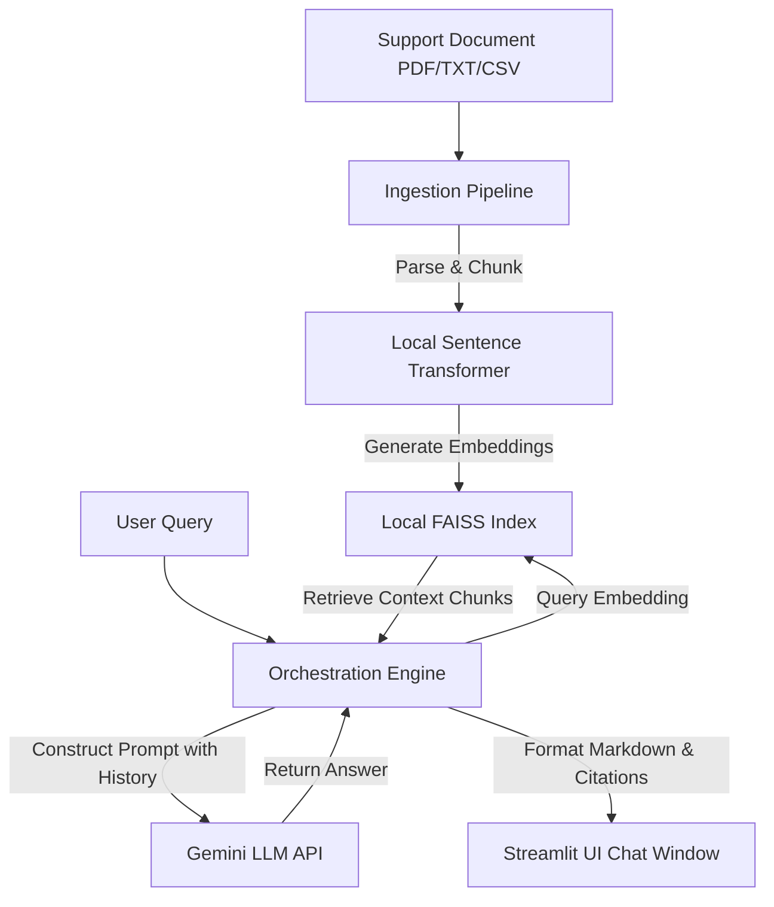

# Product Support Agentic AI Agent with Contextual Memory and Multi-Document Reasoning
## Software Requirements Specification Document (with Use Case)

## Revision History

| Version No | Date | Prepared by / Modified by | Significant Changes |
|---|---|---|---|
| 1.0 | 2026-06-13 | Codex | Initial enterprise SRS for product support agentic AI solution |

## Glossary

| Abbreviation | Description |
|---|---|
| AI | Artificial Intelligence |
| API | Application Programming Interface |
| CSV | Comma-Separated Values |
| FAISS | Facebook AI Similarity Search local vector index library |
| LLM | Large Language Model |
| PDF | Portable Document Format |
| PII | Personally Identifiable Information |
| RAG | Retrieval-Augmented Generation |
| ST | Sentence Transformers |
| UI | User Interface |
| UX | User Experience |

## Table of Contents

1 Introduction  
1.1 Purpose  
1.2 Scope  
1.3 Definitions, Acronyms and Abbreviations  
1.4 References  
1.5 Overview  
2 Overall Description  
2.1 Use-Case Model Survey  
2.2 Assumptions and Dependencies  
3 Specific Requirements  
3.1 Use-Case Reports  
3.2 Supplementary Requirements  
4 Supporting Information  

## 1 Introduction

The introduction of this SRS provides an overview of the complete requirement baseline for the Product Support Agentic AI Agent with Contextual Memory and Multi-Document Reasoning. The document defines functional behavior, non-functional requirements, constraints, assumptions, and traceable use cases needed to design, build, test, deploy, and support the solution.

### 1.1 Purpose

This SRS defines the software requirements for an enterprise-grade product support assistant that ingests multiple product documents in `PDF`, `TXT`, and `CSV` formats, builds a persistent local knowledge base using `Sentence Transformers` embeddings and `FAISS`, and answers user questions through a `Streamlit` interface using a `Gemini` LLM. The SRS is intended for architects, developers, testers, reviewers, project managers, and operations stakeholders.

The purpose of this SRS is to:

- establish a single source of truth for scope and expected behavior;
- define externally observable system capabilities;
- identify quality, security, operability, and usability expectations;
- support downstream HLD, LLD, test design, and review gates;
- minimize ambiguity during implementation and acceptance.

### 1.2 Scope

This SRS applies to a locally deployed or workstation-hosted product support AI assistant intended for knowledge-intensive support scenarios. The system will:

- allow users to upload multiple product documents;
- parse and normalize supported files;
- generate local embeddings and persistent vector indexes;
- retrieve relevant context from one or more documents;
- answer natural language queries with citations;
- preserve conversation context within the user session;
- support prompt templates and operational logging.

Out of scope for this release:

- multi-tenant SaaS deployment;
- human approval workflow orchestration;
- external ticketing system integration;
- fine-tuning of the LLM;
- scanned-image OCR beyond what is natively extractable from standard PDFs;
- LangGraph workflow orchestration, which is a future enhancement.

### 1.3 Definitions, Acronyms and Abbreviations

Project-specific definitions are listed in the glossary above. Additional domain terms are defined below.

| Term | Definition |
|---|---|
| Contextual Memory | Session-scoped conversational memory used to preserve relevant dialogue context across turns |
| Citation | Explicit reference to source document name, page or row range when available, and retrieved chunk identifier |
| Document Chunk | A semantically meaningful text segment used for embedding and retrieval |
| Knowledge Base | Persisted set of document embeddings, metadata, and source references available for retrieval |
| Prompt Template | Configurable instruction pattern applied to query generation or answer synthesis |
| Multi-Document Reasoning | Answer composition based on evidence retrieved from more than one document |

### 1.4 References

| Ref ID | Document / Source | Purpose |
|---|---|---|
| REF-01 | Project brief: Product Support Agentic AI Agent with Contextual Memory and Multi-Document Reasoning | Business and solution scope |
| REF-02 | Python language documentation | Implementation language reference |
| REF-03 | LangChain documentation | Orchestration and retrieval abstractions |
| REF-04 | Gemini API documentation | LLM integration reference |
| REF-05 | FAISS documentation | Persistent vector search reference |
| REF-06 | Sentence Transformers documentation | Local embedding model reference |
| REF-07 | Streamlit documentation | UI implementation reference |

### 1.5 Overview

Section 2 provides the overall solution description, use-case survey, assumptions, and dependencies.  
Section 3 provides detailed use-case reports and supplementary functional and non-functional requirements.  
Section 4 contains supporting information, traceability guidance, and appendices relevant to design and test activities.

## 2 Overall Description

The system is an enterprise-style product support assistant focused on accurate retrieval, evidence-backed responses, and maintainable local deployment. The primary users are support analysts, product specialists, internal operations staff, and knowledge-base maintainers.

Design rationale:

- `FAISS` is selected for local persistent vector retrieval because the solution prioritizes simplicity, performance, and offline-friendly storage over distributed search scale.
- `Sentence Transformers` is selected for embeddings to keep core retrieval independent of remote embedding API cost and latency.
- `Gemini` is used only for generation and reasoning, reducing lock-in at the retrieval layer.
- `Streamlit` is selected to accelerate delivery of an internal-facing support UI with minimal front-end overhead.

### 2.1 Use-Case Model Survey

#### Actors

| Actor | Description |
|---|---|
| Support User | End user asking product support questions against uploaded knowledge sources |
| Knowledge Administrator | User responsible for uploading, refreshing, deleting, and validating documents |
| System Operator | User responsible for environment configuration, logs, health checks, and supportability |

#### Use Cases

| Use Case ID | Use Case Name | Primary Actor | Brief Description |
|---|---|---|---|
| UC-01 | Upload and Register Documents | Knowledge Administrator | Upload one or more supported documents and register them for processing |
| UC-02 | Build or Refresh Knowledge Base | Knowledge Administrator | Parse, chunk, embed, and persist document vectors and metadata |
| UC-03 | Ask Support Question | Support User | Ask a natural language question and receive an evidence-backed answer |
| UC-04 | Continue Contextual Conversation | Support User | Ask follow-up questions within the same session using preserved conversational context |
| UC-05 | View Citations and Source Evidence | Support User | Inspect which documents and passages were used in the answer |
| UC-06 | Manage Prompt Templates and Runtime Settings | System Operator | Configure prompt templates, model parameters, and retrieval settings |
| UC-07 | Review Logs and Operational Events | System Operator | Inspect processing logs, query logs, and exception events for troubleshooting and audit |

#### Use-Case Relationships

| Relationship | Description |
|---|---|
| UC-02 extends UC-01 | Index build occurs after successful document registration |
| UC-04 extends UC-03 | Follow-up turns depend on an earlier query session |
| UC-05 extends UC-03 | Citation viewing occurs after answer generation |
| UC-07 supports all use cases | Operational logging is cross-cutting |

### 2.2 Assumptions and Dependencies

| ID | Type | Statement |
|---|---|---|
| AD-01 | Assumption | Users have access to a workstation or server with sufficient local storage for persisted FAISS indexes and source documents |
| AD-02 | Assumption | Uploaded documents are text-extractable and not predominantly image-only scans |
| AD-03 | Assumption | Gemini API credentials are available and managed outside source code |
| AD-04 | Assumption | The embedding model selected from Sentence Transformers is compatible with available CPU or optional GPU resources |
| AD-05 | Dependency | Python runtime and required libraries are installed in the target environment |
| AD-06 | Dependency | Local filesystem permissions allow read and write access for document storage, metadata, vector indexes, and logs |
| AD-07 | Constraint | Initial release is single-node and optimized for internal use rather than horizontally scaled multi-user traffic |
| AD-08 | Constraint | LangGraph orchestration is not mandatory in release 1 and may be introduced later without invalidating current requirements |

## 3 Specific Requirements

This section contains requirements at a level suitable to support architecture, detailed design, testing, and acceptance. Requirement identifiers are intentionally stable so they can be reused in HLD and LLD traceability.

### 3.1 Use-Case Reports

#### UC-01 Upload and Register Documents

| Field | Description |
|---|---|
| Goal | Accept supported files and register them for downstream ingestion |
| Primary Actor | Knowledge Administrator |
| Preconditions | User has access to the application UI; supported files are available |
| Trigger | User selects one or more files and initiates upload |
| Basic Flow | 1. User selects files. 2. System validates file type, size, and duplicate rules. 3. System stores source files in configured repository. 4. System records document metadata. 5. System returns upload result summary. |
| Alternate Flows | A1: Unsupported file type is rejected. A2: Duplicate file is flagged for replace, skip, or versioned upload based on configuration. A3: Corrupted file is quarantined and logged. |
| Postconditions | Files are registered for indexing or rejected with reason |
| Related Requirements | FR-001, FR-002, FR-014, FR-018, NFR-006 |

#### UC-02 Build or Refresh Knowledge Base

| Field | Description |
|---|---|
| Goal | Convert uploaded source documents into a persistent searchable knowledge base |
| Primary Actor | Knowledge Administrator |
| Preconditions | At least one valid document is registered |
| Trigger | User initiates indexing or refresh |
| Basic Flow | 1. System loads registered documents. 2. System extracts text and structured rows. 3. System chunks content. 4. System creates embeddings. 5. System updates FAISS index. 6. System persists metadata and indexing summary. |
| Alternate Flows | A1: Partial document parsing failure is logged and remaining documents continue. A2: Embedding generation failure aborts affected batch and preserves last good index snapshot. |
| Postconditions | Persistent index and metadata are available for retrieval |
| Related Requirements | FR-003, FR-004, FR-005, FR-006, FR-014, FR-017, NFR-001, NFR-007 |

#### UC-03 Ask Support Question

| Field | Description |
|---|---|
| Goal | Answer a user question using relevant document evidence |
| Primary Actor | Support User |
| Preconditions | Knowledge base exists and Gemini connectivity is available |
| Trigger | User submits a natural language query |
| Basic Flow | 1. System validates query. 2. System retrieves relevant chunks from FAISS. 3. System builds prompt using configured template. 4. System sends prompt to Gemini. 5. System returns answer with citations and metadata. |
| Alternate Flows | A1: No relevant documents are found, and system returns a grounded “no evidence found” response. A2: Gemini call fails and system returns recoverable error. |
| Postconditions | Answer and citations are shown and query event is logged |
| Related Requirements | FR-007, FR-008, FR-010, FR-011, FR-012, FR-015, NFR-002, NFR-004 |

#### UC-04 Continue Contextual Conversation

| Field | Description |
|---|---|
| Goal | Allow follow-up questions using session memory without losing retrieval grounding |
| Primary Actor | Support User |
| Preconditions | A prior question-answer interaction exists in the current session |
| Trigger | User submits a follow-up query |
| Basic Flow | 1. System loads session memory. 2. System optionally reformulates the follow-up query. 3. System performs retrieval. 4. System generates context-aware answer. |
| Alternate Flows | A1: Memory overflow threshold is exceeded and system summarizes session history. A2: Session expired and system requests a fresh query context. |
| Postconditions | Follow-up answer is available with citations and updated memory state |
| Related Requirements | FR-009, FR-010, FR-011, FR-012, NFR-003 |

#### UC-05 View Citations and Source Evidence

| Field | Description |
|---|---|
| Goal | Let the user inspect source provenance and supporting text |
| Primary Actor | Support User |
| Preconditions | A response with citations exists |
| Trigger | User selects citation details |
| Basic Flow | 1. System retrieves citation metadata. 2. System shows source file, page or row context, and chunk excerpt. |
| Alternate Flows | A1: Source excerpt is unavailable for a corrupted metadata record and system shows fallback citation details with warning. |
| Postconditions | Evidence trail is displayed |
| Related Requirements | FR-010, FR-013, NFR-005 |

#### UC-06 Manage Prompt Templates and Runtime Settings

| Field | Description |
|---|---|
| Goal | Configure prompt patterns and selected retrieval or generation parameters |
| Primary Actor | System Operator |
| Preconditions | Operator access is available |
| Trigger | Operator edits runtime or prompt configuration |
| Basic Flow | 1. Operator updates template or setting. 2. System validates configuration. 3. System persists settings. 4. Updated configuration is used for subsequent queries. |
| Alternate Flows | A1: Invalid configuration is rejected with validation errors. |
| Postconditions | Approved configuration becomes active |
| Related Requirements | FR-011, FR-016, NFR-008 |

#### UC-07 Review Logs and Operational Events

| Field | Description |
|---|---|
| Goal | Support troubleshooting, observability, and audit review |
| Primary Actor | System Operator |
| Preconditions | Logging is enabled and data exists |
| Trigger | Operator opens logs or exports diagnostics |
| Basic Flow | 1. System loads structured logs. 2. Operator filters by event type, time, or request. 3. System displays outcomes and error details. |
| Alternate Flows | A1: Log file is unavailable and system reports operational issue. |
| Postconditions | Operational events are reviewable |
| Related Requirements | FR-012, FR-017, NFR-009 |

### 3.2 Supplementary Requirements

This section details the supplementary requirements for the Product Support Agentic AI Agent, including functional specifications, usability, performance, reliability, security, portability, configurability, and logging.

#### 3.2.1 Functional Requirements

The table below outlines the specific functional requirements necessary to realize the use cases in Section 3.1.

| Req ID | Title | Description | Fit Criterion | Traceability |
|---|---|---|---|---|
| **FR-001** | Document Upload | The system shall provide an interface for uploading multiple files concurrently in PDF (`.pdf`), plain text (`.txt`), and structured comma-separated values (`.csv`) formats. | Files are uploaded to a configured staging directory and registered in the session. | UC-01 |
| **FR-002** | Upload Validation | The system shall validate uploaded files against size constraints (max 50MB per file) and file extensions, rejecting invalid or empty documents. | Invalid files trigger a warning message and are not saved. | UC-01 |
| **FR-003** | Text Parsing & Extraction | The system shall extract raw text from PDF and TXT files, and read rows from CSV files, preserving document structure and logical ordering (e.g., page numbers, column headers). | Text is extracted as UTF-8 encoded strings without loss of significant characters. | UC-02 |
| **FR-004** | Document Chunking | The system shall segment parsed text into semantically cohesive chunks using a recursive character splitting algorithm with configurable chunk size and chunk overlap. | Default chunks are 1,000 characters with a 200-character overlap. | UC-02 |
| **FR-005** | Local Embeddings Generation | The system shall compute vector embeddings for all text chunks using a locally hosted Sentence Transformers model (`all-MiniLM-L6-v2` or similar) without external API calls. | Vector dimensions must match the embedding model output (typically 384). | UC-02 |
| **FR-006** | FAISS Index Persistence | The system shall construct, update, and persist a FAISS vector index locally on the server storage, mapping chunks to their source metadata. | The index is written to a designated local path as `.index` and `.pkl` files. | UC-02 |
| **FR-007** | Vector Similarity Search | The system shall perform similarity searches in the FAISS index using cosine similarity or L2 distance based on user query embeddings. | The search returns the top $K$ (configurable, default $K=4$) relevant chunks. | UC-03 |
| **FR-008** | Gemini LLM Query Generation | The system shall synthesize natural language answers from retrieved context using the Gemini Pro API, passing a custom instruction prompt. | The LLM response is returned as a clean markdown-rendered string. | UC-03 |
| **FR-009** | Session Context Memory | The system shall maintain session-scoped conversation history, enabling follow-up questions to refer to previous turns. | The system reformulates follow-up queries using history or includes history in the prompt. | UC-04 |
| **FR-010** | Multi-Document Reasoning | The system shall synthesize answers that combine evidence retrieved across multiple distinct source documents when necessary. | The LLM consolidates overlapping or complementary data from separate sources. | UC-03, UC-04 |
| **FR-011** | Prompt Template Customization | The system shall load and apply configurable prompt templates, allowing operators to modify default system instructions. | The prompt template includes placeholders for `{context}` and `{question}`. | UC-06 |
| **FR-012** | Model Parameter Controls | The system shall allow runtime modification of LLM parameters, including temperature ($0.0$ to $1.0$), Top-P, and Top-K. | Parameter changes take effect on the next query without requiring a restart. | UC-06 |
| **FR-013** | Source Citation Generation | The system shall trace LLM responses back to their source chunks and display citations, including filename, page/row range, and chunk preview. | Every fact in the answer points to its index location in the source documents. | UC-05 |
| **FR-014** | Metadata Registry Management | The system shall maintain a local registry (e.g., JSON file) listing indexed files, upload dates, file size, chunk counts, and status. | A management panel shows the list of registered files with "Delete" options. | UC-01, UC-02 |
| **FR-015** | Grounding Validation | The system shall implement basic checks to ensure the LLM output is grounded in the retrieved context, flagging potential hallucinations. | If context is insufficient, the system instructs the LLM to state "No evidence found". | UC-03 |
| **FR-016** | Configuration Export/Import | The system shall support exporting and importing configuration files (YAML format) containing prompts, model settings, and chunk sizes. | Validated configuration changes are applied and stored locally. | UC-06 |
| **FR-017** | Activity Logging | The system shall record all ingestion activities, query events, model response times, token counts (when available), and search similarity scores. | Log entries are written to a rolling log file in JSON or text format. | UC-07 |
| **FR-018** | Document Security Isolation | The system shall restrict document storage and indexing access to the local workstation or authenticated session user. | Ingested files are stored in a designated workspace directory with read/write restrictions. | UC-01 |

#### 3.2.2 Non-Functional Requirements

##### 3.2.2.1 Performance Requirements

* **NFR-001 (Ingestion Speed)**: The system shall process, chunk, embed, and index a 10MB text-rich PDF document in under 15 seconds on a standard dual-core CPU workstation.
* **NFR-002 (Search Latency)**: Local vector similarity search retrieval within a FAISS index containing up to 100,000 chunks must execute in less than 150 milliseconds.
* **NFR-003 (LLM Response Latency)**: The system shall stream or return the final Gemini LLM response within 3.5 seconds of query submission, excluding network propagation latency.

##### 3.2.2.2 Scalability Requirements

* **NFR-004 (Index Capacity)**: The local FAISS vector store shall support indexing up to 50 distinct documents or a total of 100,000 text chunks without exceeding 4GB of workstation RAM.
* **NFR-005 (File Upload Capacity)**: The system shall support concurrent uploading of up to 10 files in a single operation, with a cumulative size limit of 150MB per batch.

##### 3.2.2.3 Reliability and Availability Requirements

* **NFR-006 (Offline Capability)**: Embedding generation and vector similarity search must remain 100% operational offline. Only LLM reasoning requires internet connectivity.
* **NFR-007 (Graceful Degradation)**: If the Gemini API is unavailable, the system shall degrade gracefully by displaying the top retrieved text chunks with a warning that LLM synthesis is offline.

##### 3.2.2.4 Usability Requirements

* **NFR-008 (User Interface)**: The Streamlit interface shall be intuitive, requiring zero training for support users. The chat layout must feature a side-by-side design: chat workspace on the left, document indexing status and citation preview on the right.
* **NFR-009 (Status Indicators)**: The system shall provide visible spinners, progress bars, and success notifications for all long-running processes (e.g., file ingestion and index generation).

##### 3.2.2.5 Security and Compliance Requirements

* **NFR-010 (Data Leakage Prevention)**: The system shall process and store all raw text, chunks, and vector embeddings locally. No document text or embeddings shall be transmitted to third parties except query context sent to the Gemini API.
* **NFR-011 (Credential Management)**: Gemini API keys must never be hardcoded or written to disk. The system shall load keys from environment variables (`GEMINI_API_KEY`) or an runtime UI text input mask with hidden characters.
* **NFR-012 (Data Sanitation)**: All uploaded text must be sanitized to prevent code injection attacks (e.g., Markdown injection, HTML stripping).

##### 3.2.2.6 Portability Requirements

* **NFR-013 (Platform Independence)**: The software shall run on Windows 10/11, macOS, and Linux (Ubuntu 20.04+) using a standard Python 3.9+ virtual environment.
* **NFR-014 (Browser Compatibility)**: The Streamlit UI must render correctly on standard modern web browsers, including Chrome, Safari, Edge, and Firefox.

##### 3.2.2.7 Logging and Supportability Requirements

* **NFR-015 (Structured Logging)**: The system shall write logs to `logs/support_agent.log` in a structured format containing Timestamp, Log Level, Component, Thread ID, and Event Message.
* **NFR-016 (Audit Trail)**: Every user query, returned citation list, and ingestion activity must be logged for auditability, excluding actual PII or sensitive document contents to maintain privacy.

---

## 4 Supporting Information

The supporting information provides a mapping between the requirements and the use cases, the technical environment specifications, and appendices for configuration.

### 4.1 Requirement Traceability Matrix

The matrix below traces Use Cases to Functional and Non-Functional Requirements.

| Use Case ID | Use Case Name | Traced Functional Requirements | Traced Non-Functional Requirements |
|---|---|---|---|
| **UC-01** | Upload and Register Documents | FR-001, FR-002, FR-014, FR-018 | NFR-005, NFR-008, NFR-010 |
| **UC-02** | Build or Refresh Knowledge Base | FR-003, FR-004, FR-005, FR-006, FR-014, FR-017 | NFR-001, NFR-004, NFR-006, NFR-009 |
| **UC-03** | Ask Support Question | FR-007, FR-008, FR-010, FR-011, FR-012, FR-015 | NFR-002, NFR-003, NFR-007, NFR-010, NFR-011 |
| **UC-04** | Continue Contextual Conversation | FR-009, FR-010, FR-011, FR-012 | NFR-003, NFR-007, NFR-011 |
| **UC-05** | View Citations and Source Evidence | FR-010, FR-013 | NFR-008, NFR-010 |
| **UC-06** | Manage Prompt Templates and Settings | FR-011, FR-016 | NFR-008, NFR-011 |
| **UC-07** | Review Logs and Operational Events | FR-012, FR-017 | NFR-015, NFR-016 |

### 4.2 Appendix A: Configuration Schema (YAML)

The system is configured via a local `config/settings.yaml` file. Below is the approved template:

```yaml
system:
  environment: local
  log_level: INFO
  log_file: logs/support_agent.log
  data_dir: data/documents
  vector_store_dir: data/faiss_index

ingestion:
  chunk_size: 1000
  chunk_overlap: 200
  supported_extensions:
    - pdf
    - txt
    - csv

embedding:
  model_name: "sentence-transformers/all-MiniLM-L6-v2"
  device: "cpu" # Options: cpu, cuda

llm:
  provider: gemini
  model_name: "gemini-1.5-pro"
  temperature: 0.2
  top_p: 0.95
  max_output_tokens: 2048

prompts:
  default_rag: |
    You are an expert product support assistant. Use the following pieces of retrieved context to answer the question at the end.
    If you do not know the answer or if it is not supported by the context, state "I cannot find sufficient evidence in the uploaded documents to answer your question."
    Do not make up facts or extrapolate beyond the provided text.
    
    Context:
    {context}
    
    Question: {question}
    Answer:
```

### 4.3 Appendix B: Context Flow Diagram

The diagram below represents the logical context flow of the agent at a systems level:


