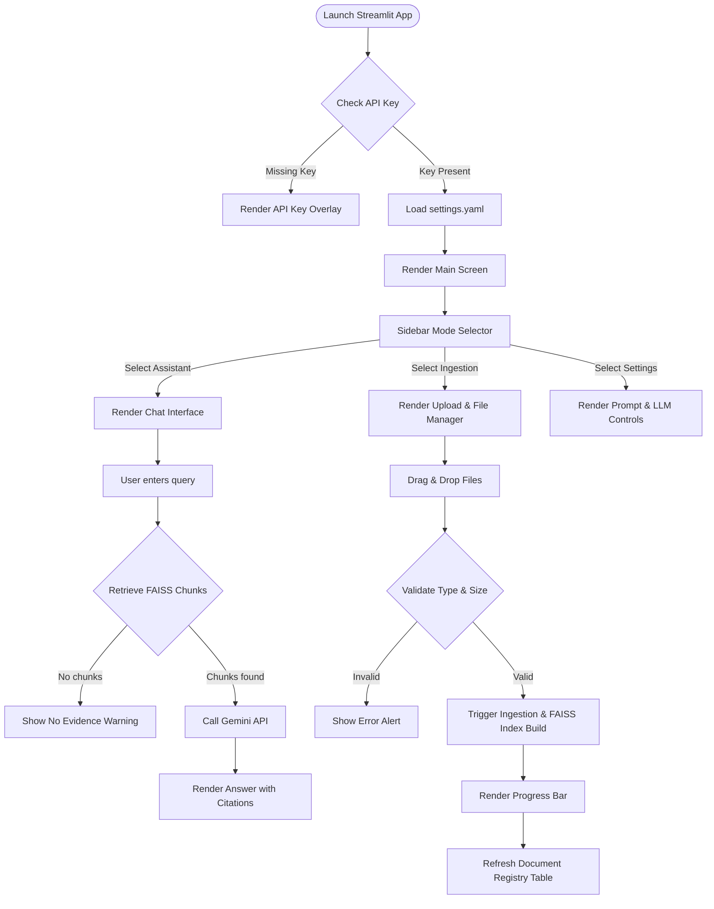

# Product Support Agentic AI Agent with Contextual Memory and Multi-Document Reasoning
## User Interface Design (UID) Document

## Revision History

| Version No | Date | Prepared by / Modified by | Significant Changes |
|---|---|---|---|
| 1.0 | 2026-06-13 | Senior UX Architect | Initial User Interface Design specification and Streamlit layout blueprint |

---

## 1 Overview

### 1.1 Purpose

This document defines the User Interface Design (UID) and User Experience (UX) specifications for the **Product Support Agentic AI Agent**. It serves as the design blueprint for developers, product managers, and QA engineers. The goals of this document are to:
- Establish consistent layout grids, color palettes, and typographic hierarchies.
- Document user characteristics, personas, and navigation pathways.
- Define Streamlit-specific UI elements and state configurations.
- Detail usability, accessibility, and error presentation frameworks.

### 1.2 Scope

The scope of this UI design covers all interactive elements of the Streamlit application:
- **Workspace Navigation**: Selection of view modes (e.g., Support Assistant, Document Administrator, System Configuration).
- **Document Ingestion Interface**: File upload, validation feedback, and indexing status indicators.
- **Support Chat Interface**: Chat messages, typing states, and history scroll.
- **Context & Citation Panel**: Grounding evidence, interactive source citations, and document metadata previewers.
- **Administrative Panels**: Prompt configuration, temperature controls, and system log monitors.

### 1.3 Brief Description of Product

The **Product Support Agentic AI Agent** is an internal support acceleration tool. It allows product specialists to upload and index technical manuals, product release notes, and structured data tables. The application enables users to run semantic searches and generate natural language answers with source-grounded citations. By using a local Sentence Transformers embedding model and a local FAISS index, the tool provides high-speed contextual retrieval. The Streamlit-based UI organizes these capabilities into an intuitive workspace.

---

## 2 Design User Interface

### 2.1 User Characteristics

The application has three primary classes of users, described in the personas below:

#### Persona 1: Sarah – Senior Customer Support Specialist
* **Role**: Primary user of the chat interface. Responds to customer tickets and troubleshooting inquiries.
* **Context**: Under pressure to resolve tickets within a tight SLA. Requires immediate, highly accurate answers with direct citations.
* **UX Needs**: High-contrast text, clear evidence trails, fast response loading, and copy-to-clipboard functionality for answers.

#### Persona 2: Dave – Knowledge Administrator
* **Role**: Primary user of the document management and upload panel.
* **Context**: Maintains product manuals, updating files as new releases occur.
* **UX Needs**: Clear drag-and-drop zones, file size/type warnings, index refresh status indicators, and a clean file deletion list.

#### Persona 3: Alex – IT Support Engineer
* **Role**: Configures prompt templates and monitors model settings.
* **Context**: Adjusts temperature parameters and system instructions to tune response quality.
* **UX Needs**: Structured input text areas for prompt templates, numeric sliders for LLM parameters, and structured event log views.

---

### 2.2 Primary User Interface Elements

The UI is divided into three functional regions:

```
+-----------------------------------------------------------------------------+
|  LOGO & TITLE                             [Status: API connected / Offline] |
+-----------------------------------+-----------------------------------------+
|                                   |                                         |
|  SIDEBAR                          |  MAIN WORKSPACE                         |
|  +-----------------------------+  |  +-----------------------------------+  |
|  | VIEW SELECTION              |  |  |                                   |  |
|  | [o] Chat Assistant          |  |  |  CHAT DIALOGUE & RESPONSE AREA    |  |
|  | [ ] Ingest Manager          |  |  |                                   |  |
|  | [ ] System Settings         |  |  |                                   |  |
|  +-----------------------------+  |  +-----------------------------------+  |
|  | INDEXED DOCUMENTS           |  |  |                                   |  |
|  | - User_Manual_V1.pdf        |  |  |  QUERY INPUT MASK                 |  |
|  | - Release_Notes.txt         |  |  |  [ Ask a question...            ] |  |
|  | - Pricing_Table.csv         |  |  |                                   |  |
|  +-----------------------------+  |  +-----------------------------------+  |
|                                   |                                         |
+-----------------------------------+-----------------------------------------+
```

1. **Sidebar Controls (Global Context)**: Holds the navigation buttons (App Mode), indexing indicators, and a summary list of currently active knowledge documents.
2. **Main Workspace (Interactive Content)**:
   - **Assistant Mode**: Multi-turn chat interface with user/assistant bubbles and citations.
   - **Ingest Manager Mode**: Drag-and-drop upload workspace and data registry table.
   - **System Settings Mode**: Configuration sliders, prompt editing text areas, and log viewers.
3. **Floating/Collapsible Citation Drawer (Context Overlay)**: Renders side-by-side or as expandable markdown sections below the LLM responses, showing exact source matches.

---

### 2.3 Define Navigation Map

The screen flow below outlines how users navigate between states in the Streamlit application:



---

### 2.4 User Interface Design Elements

#### Color Palette (Dark Theme / Glassmorphism)
The design prioritizes a high-contrast dark theme optimized for technical support personnel working extended shifts.

* **Primary Background**: HSL(222, 19%, 12%) - Deep dark slate.
* **Secondary Card/Sidebar**: HSL(222, 19%, 16%) - Lightened slate.
* **Primary Accent (Brand)**: HSL(210, 100%, 66%) - Bright cobalt blue.
* **Success Accent (Active status)**: HSL(145, 63%, 42%) - Soft emerald green.
* **Warning/Alert Accent**: HSL(10, 80%, 55%) - Warm amber red.
* **Text - Primary**: HSL(210, 20%, 98%) - Crisp off-white.
* **Text - Secondary/Muted**: HSL(210, 15%, 75%) - Muted steel gray.

#### Typography
* **Primary Font**: `Inter`, sans-serif (clean sans-serif for UI layout, labels, and text fields).
* **Secondary Font**: `Roboto Mono`, monospace (used for source citations, log displays, metadata statistics, and code snippets).
* **Hierarchy**:
  - `H1`: 32px, Semibold, primary text (App Title)
  - `H2`: 24px, Medium, primary text (Section Headings)
  - `H3/Sidebar Header`: 16px, Semibold, primary text
  - `Body Text`: 14px, Regular, secondary text
  - `Captions/Metadata`: 11px, Regular, secondary muted

---

### 2.5 User Interface Prototype

#### 2.5.1 Design the User Interface Prototype

##### UI Page 1: Support Assistant Workspace
* **Layout**: Left sidebar (navigation and active index stats) occupies 25% width. Main panel occupies 75% width.
* **Chat Elements**: User chat entries are styled with a secondary background card shifted to the right, and the Assistant chat entries are aligned left with a primary accent border.
* **Citations**: Renders beneath each assistant response using an expandable accordion (`st.expander`) with a book icon. Inside, citations are organized in tabs: `Tab 1: Citation 1 (Source File)`, `Tab 2: Citation 2 (Source File)`. Each tab lists the page number, similarity score (%), and exact text snippet.

##### UI Page 2: Document Ingest Manager
* **Drag-and-Drop Area**: Centered dotted-border box styled with a file-upload icon. Displays "Drag and drop PDF, TXT, or CSV here (Max 50MB per file)".
* **Progress Bar**: Underneath the file uploader. Displays dynamic states: "Parsing text...", "Generating embeddings...", "Saving FAISS Index...".
* **Document Registry Table**: Grid layout (`st.dataframe`) detailing:
  - Document Name | File Type | Chunks | Status (Indexed / Failed) | Action (Delete Button)

##### UI Page 3: System Settings & Log Monitor
* **Model Configuration**: Columns of sliders for LLM settings (`Temperature`, `Top-P`, `Max Tokens`).
* **Prompt Manager**: Multi-line text area showing the default RAG template, permitting operators to change the instruction set.
* **Log Monitor**: High-contrast code-block (`st.code`) with a max height of 400px and a scrollbar, displaying structured logs in reverse chronological order.

---

#### 2.5.2 Implement the User Interface Prototype

The Streamlit UI prototype will be organized using the following structural layout layout:

```python
import streamlit as st

# 1. Page Configuration (Title, Icon, Layout)
st.set_page_config(
    page_title="Agentic Support Assistant",
    page_icon="🤖",
    layout="wide",
    initial_sidebar_state="expanded"
)

# 2. Apply Custom CSS (Color Palette, Typography, Glassmorphism Cards)
st.markdown("""
    <style>
    .reportview-container {
        background-color: #121620;
    }
    .sidebar .sidebar-content {
        background-color: #1a1f2c;
    }
    .stChatInput {
        border-color: #3b82f6;
    }
    .citation-card {
        border-left: 3px solid #3b82f6;
        padding-left: 10px;
        margin-bottom: 8px;
    }
    </style>
""", unsafe_allow_html=True)

# 3. Sidebar Navigation & Active Index Summary
with st.sidebar:
    st.title("🤖 Support Agent")
    app_mode = st.radio("Navigation", ["Support Assistant", "Ingest Manager", "System Settings"])
    
    st.markdown("---")
    st.subheader("📚 Active Knowledge Base")
    # Displays dynamic list of indexed files and status
    st.info("FAISS Vector Index: Loaded (3 Files, 1,240 Chunks)")

# 4. View Mode Routing
if app_mode == "Support Assistant":
    st.header("💬 AI Support Assistant")
    # Render Chat Workspace (st.chat_message)
    # Render Citations inside st.expander
    # Render Input box at bottom (st.chat_input)

elif app_mode == "Ingest Manager":
    st.header("📂 Document Ingestion Workspace")
    # File Uploader (st.file_uploader)
    # Progress indicators (st.progress)
    # Document registry (st.dataframe)

elif app_mode == "System Settings":
    st.header("⚙️ Prompt & Engine Configuration")
    # Parameter sliders
    # Template text_area
```

---

#### 2.5.3 Prototype Feedback

##### Error Messages and Visual Banners
* **API Connection Failure**: A red banner (`st.error`) at the top of the main screen: *"Error: Unable to connect to Gemini LLM API. Check your internet connection and API key configuration."*
* **File Upload Violations**: An warning box (`st.warning`) beneath the drag-and-drop zone: *"File size exceeds 50MB. Upload failed."* or *"Invalid format: Only .pdf, .txt, and .csv files are supported."*
* **Retrieval Silence**: A yellow notice (`st.info`) when similarity results fall below threshold: *"No matching documentation found. The assistant will answer using general training memory if permitted, or state insufficient context."*

##### Accessibility Considerations (A11y)
* **Keyboard Navigation**: Streamlit components natively support standard tab and enter key navigation. Input boxes automatically receive cursor focus upon page load.
* **Screen Reader Compatibility**: Text fields, file managers, and tables must use descriptive, unique labels rather than plain icons.
* **Color Contrast**: Main text has a contrast ratio of >7:1 against background slates to meet WCAG 2.1 AA requirements.

##### Responsive Design Considerations
* **Mobile Layout**: Sidebar automatically collapses into a burger menu on screen widths below 768px.
* **Grid Reflow**: Columns reflow into a single stacked vertical card layout on tablet/mobile views.
* **Table Scroll**: Large data tables are rendered with horizontal and vertical overflow scrollbars to prevent UI clipping.
