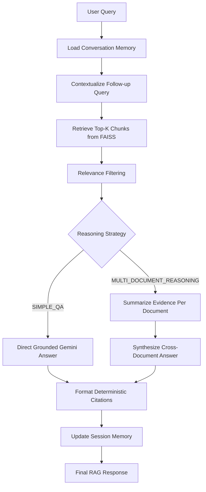

# Product Support Agentic AI Agent with Contextual Memory and Multi-Document Reasoning

This project is an enterprise-style product support assistant built in phased increments. The current implementation includes:

- Phase 3: document ingestion, chunking, local embeddings, and persistent FAISS indexing
- Phase 4: semantic retrieval from the persistent FAISS knowledge base
- Phase 5: Gemini-powered grounded RAG answer generation with deterministic citations
- Phase 6: session-scoped conversation memory and follow-up query contextualization
- Phase 7: LangGraph orchestration and multi-document reasoning

The system answers questions only from indexed document evidence. Conversation memory is used to resolve follow-up queries, not as a factual source.

## Technology Stack

- Python 3.11+
- Streamlit
- LangGraph
- LangChain text splitters
- Google Gemini SDK (`google-genai`)
- FAISS
- Sentence Transformers
- PyPDF
- Pandas
- python-dotenv
- pytest

## Current Workflow



## Why LangGraph

LangGraph is used as the orchestration layer around the existing custom services so the project can support:

- explicit node-based execution for memory, retrieval, filtering, reasoning, generation, and citation formatting
- deterministic routing between simple QA and multi-document reasoning
- clear debug visibility into which stages executed
- safe fallback behavior when retrieval or generation cannot produce grounded output

The project does not replace working Phase 3-6 services with generic abstractions. LangGraph coordinates those services.

## LangGraph Architecture

The `RAGService` remains the public entry point for the Streamlit UI and tests. Internally it now executes a LangGraph `StateGraph` with these nodes:

1. `load_memory`
2. `contextualize_query`
3. `retrieve_chunks`
4. `filter_relevance`
5. `determine_reasoning_strategy`
6. `simple_grounded_answer`
7. `summarize_document_evidence`
8. `synthesize_multi_document_answer`
9. `format_citations`
10. `update_memory`

Conditional routing is used for:

- no retrieved chunks -> insufficient-evidence fallback
- no relevant chunks after threshold filtering -> insufficient-evidence fallback
- simple grounded QA vs multi-document reasoning
- multi-document reasoning failure -> existing safe generation-unavailable behavior

## Graph State

The LangGraph state carries the minimum execution data required across nodes:

- original query
- resolved retrieval query
- recent conversation history
- raw retrieved chunks
- relevance-filtered chunks
- reasoning strategy
- per-document evidence summaries
- generated answer
- citations
- source document list
- retrieved and relevant chunk counts
- grounded/fallback status
- message and error details
- executed node list

These values are returned through the existing `RAGResponse` contract so the UI and tests can inspect them without introducing duplicate response models.

## Reused Services

Phase 7 reuses the existing application services instead of replacing them:

- `ConversationMemoryService` loads and updates session history
- `QueryContextualizer` rewrites ambiguous follow-up questions into standalone retrieval queries
- `RetrieverService` performs query validation and persistent FAISS retrieval
- `GeminiService` handles Gemini prompt execution and finish-reason validation
- `PromptManager` owns prompt asset creation and loading
- `VectorStoreService` remains responsible for persistent FAISS storage and retrieval data

## Multi-Document Reasoning

Multi-document reasoning is intentionally lightweight and grounded:

1. Retrieve relevant chunks.
2. Group evidence by source document.
3. Summarize each document's evidence with Gemini using only the retrieved chunks for that document.
4. Synthesize the final answer across summaries using only the summarized evidence.
5. Build citations deterministically in Python from retrieval metadata.

The system does not expose chain-of-thought. Only concise document evidence summaries are retained for debugging.

## Memory Behavior

Conversation memory is session-scoped and in-memory only.

- Recent user messages and grounded assistant responses are loaded before contextualization.
- Memory helps resolve references like "that", "after that", or "the previous one".
- FAISS retrieval remains the factual source of truth.
- After answering, the original user question and assistant response are stored back into the session memory.

## Citation Grounding

Source citations come from retrieval metadata, not from Gemini text generation. Each citation preserves:

- file name
- page number when available
- row number when available
- chunk number when available
- chunk ID

This keeps answers auditable and prevents invented filenames or page references.

## Project Structure

```text
.
|-- app.py
|-- requirements.txt
|-- .env.example
|-- README.md
|-- prompts/
|   |-- system_prompt.txt
|   |-- query_contextualization_prompt.txt
|   |-- document_summary_prompt.txt
|   `-- multi_document_synthesis_prompt.txt
|-- src/product_support_agent/
|   |-- config.py
|   |-- exceptions.py
|   |-- logger.py
|   |-- utils.py
|   |-- models/
|   |   `-- schemas.py
|   |-- services/
|   |   |-- gemini_service.py
|   |   |-- memory.py
|   |   |-- prompt_manager.py
|   |   |-- query_contextualizer.py
|   |   |-- rag_service.py
|   |   |-- retriever.py
|   |   `-- vector_store.py
|   `-- ui/
|       `-- sections.py
`-- tests/
```

## Installation

1. Create and activate a virtual environment.

```powershell
python -m venv .venv
.venv\Scripts\Activate.ps1
```

2. Install dependencies.

```powershell
pip install -r requirements.txt
```

3. Create a local environment file.

```powershell
copy .env.example .env
```

4. Set required environment values in `.env`.

Minimum Gemini-related settings:

```env
GEMINI_API_KEY=
GEMINI_MODEL=gemini-3.5-flash
GEMINI_MAX_OUTPUT_TOKENS=512
CONTEXTUALIZER_MAX_OUTPUT_TOKENS=512
```

5. Start the application.

```powershell
streamlit run app.py
```

## Configuration

All runtime configuration is centralized in [`config.py`](/D:/hcl/src/product_support_agent/config.py):

- document and vector-store paths
- chunking configuration
- supported upload types
- embedding model selection
- Gemini settings
- contextualizer settings
- RAG relevance threshold
- conversation-memory limits
- logging configuration

Environment variables are loaded from the project root `.env` file through `python-dotenv`, with code defaults acting as safe fallbacks.

## Testing

Run the full test suite with a writable local pytest temp directory:

```powershell
.venv\Scripts\python.exe -m pytest -q tests --basetemp D:\hcl\.tmp_pytest
```

The `--basetemp` override is useful in environments where the default user temp directory is restricted.

## Manual Verification

### Simple QA

1. Start Streamlit.
2. Ask a factual question from one indexed document.
3. Confirm the debug panel shows:
   - `SIMPLE_QA`
   - resolved retrieval query
   - executed graph nodes
   - retrieved and relevant chunk counts
4. Confirm the answer includes grounded citations.

### Conversation Memory

1. Ask a grounded question.
2. Ask an ambiguous follow-up such as `What comes after that?`
3. Confirm the resolved retrieval query is rewritten into a standalone question.
4. Confirm retrieval and the final answer remain grounded in FAISS evidence.

### Multi-Document Reasoning

1. Index at least two related documents.
2. Ask: `Compare the installation requirements described in these documents.`
3. Confirm the debug panel shows:
   - `MULTI_DOCUMENT_REASONING`
   - multiple source documents
   - document evidence summaries
   - graph nodes including summarization and synthesis
4. Confirm citations point to the retrieved documents.

### Insufficient Evidence

1. Ask something not present in the indexed documents.
2. Confirm the answer falls back to:
   `I could not find enough information in the available knowledge base to answer this question.`
3. Confirm no hallucinated answer is produced.
